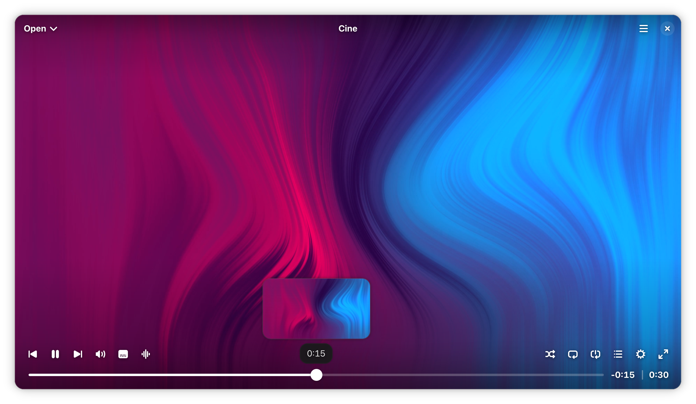
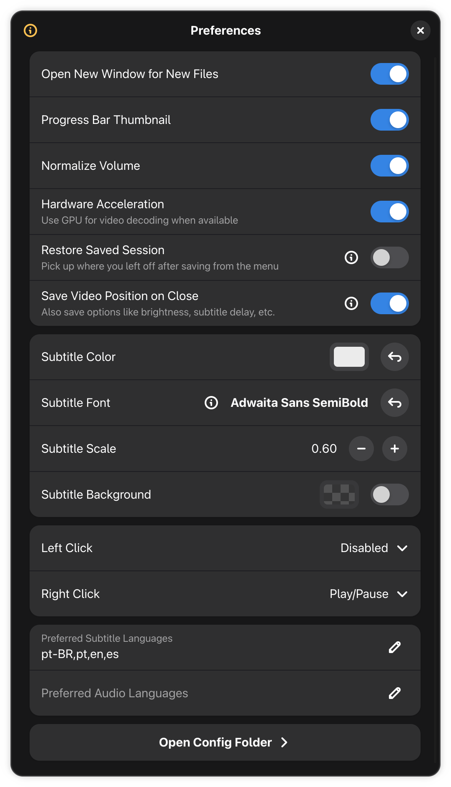
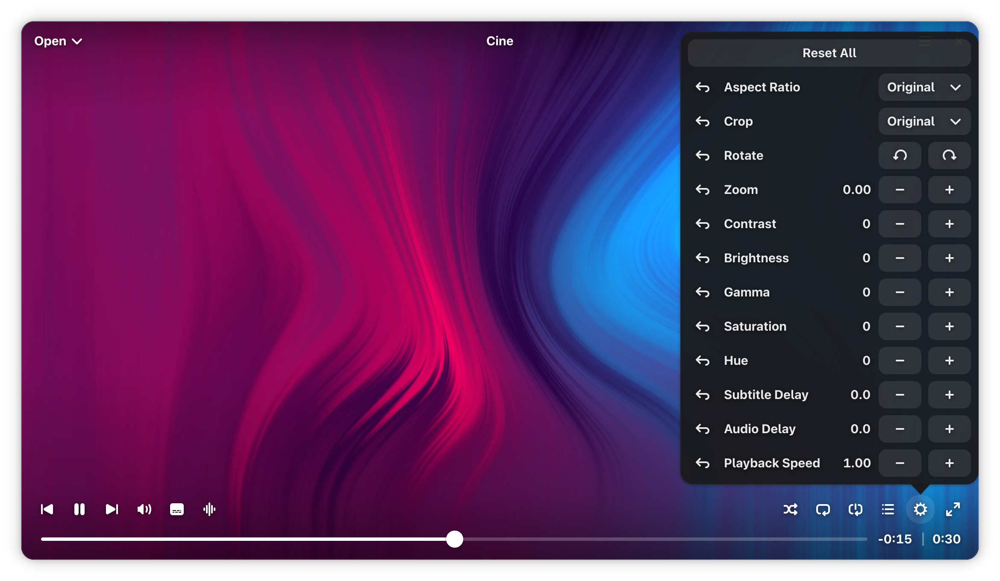
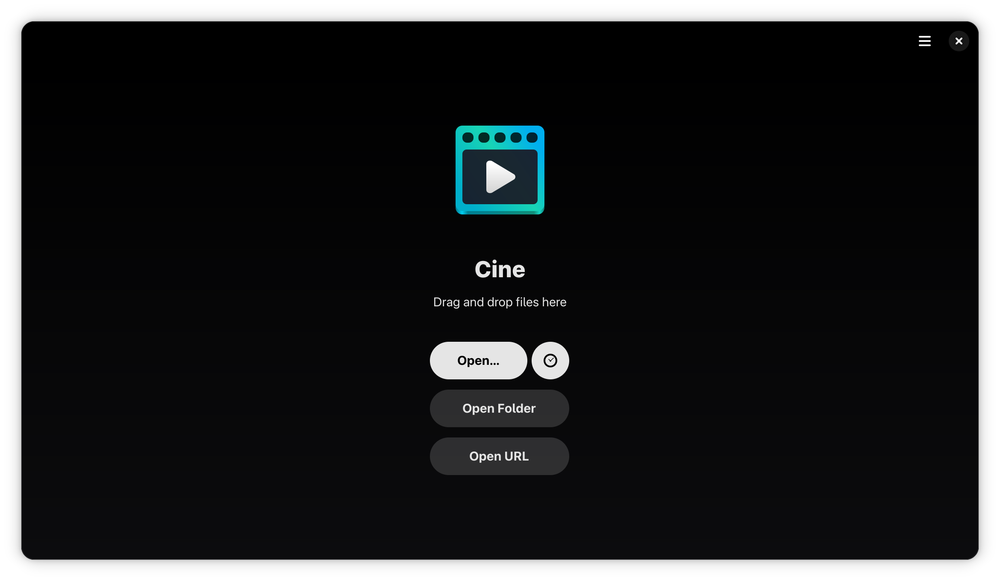

# Popcorn Box
This is version 2.0 beta WIP, to make nvida+wayland+gnome video player works; now using Cine player instead of basic mpv.


A Stremio-compatible native media client built specifically for GNU/Linux using **Python 3**, **GTK4**, and **Libadwaita**.

use STABLE 1.2 (nvida+wayland+gnome blanks video player)
### 🛠 Installation & Usage
Open this flatpak with Gnome Software: [io.github.fastrizwaan.PopcornBox.flatpak](https://github.com/fastrizwaan/popcorn-box/releases/download/1.2/io.github.fastrizwaan.PopcornBox.flatpak)

### Method 1: Install Flatpak via CLI (Recommended)

```bash
flatpak --user remote-add --if-not-exists flathub https://dl.flathub.org/repo/flathub.flatpakrepo
flatpak --user install flathub org.gnome.Platform//50
wget -c https://github.com/fastrizwaan/popcorn-box/releases/download/1.2/io.github.fastrizwaan.PopcornBox.flatpak
flatpak install --user io.github.fastrizwaan.PopcornBox.flatpak
```

Run the application:
```bash
flatpak run io.github.fastrizwaan.PopcornBox
```

### Method 2: Build and Install via Flatpak
##### Current github has version 2.0-beta is being worked on using Cine player as backend.
The installation script compiles, sandboxes, and installs the application locally:

```bash
git clone https://github.com/fastrizwaan/PopcornBox.git
cd PopcornBox
chmod +x build_bundle.sh
./build_bundle.sh
```

#### Create flatpak-bundle (.flatpak file)
```
flatpak build-bundle ~/.local/share/flatpak/repo io.github.fastrizwaan.PopcornBox.flatpak io.github.fastrizwaan.PopcornBox
```
Licensed under the **GPL-3.0-or-later** license. See the `COPYING` file for details.


### PopcornBox 2.0

Watch movies, series, and stream videos seamlessly

<br>

<a href='https://flathub.org/apps/io.github.diegopvlk.Cine'></a>

### Description

Cine combines a clean interface with a high-performance engine to deliver a seamless viewing experience.

### Features

- **Simple Design** — A refined, distraction-free interface
- **MPV-Based** — Leverages the robust power of MPV for great playback and format support
- **Audio and Subtitles** — Control track selection and synchronization for both
- **Video Controls** — Easily adjust brightness, contrast, zoom, aspect ratio, etc.

### Screenshot

<p align="center"></p>

<div>
  <details>
    <summary>More Screenshots (Expand):</summary><br>
      <p align="center"></p>
      <p align="center"></p>
      <p align="center"></p>
  </details>
</div>

### Donate

If you want to help with a donation (thank you!), you can use:

- [PayPal](https://www.paypal.com/donate?hosted_button_id=DVL7H35GA66X6)
- [Ko-fi](https://ko-fi.com/diegopvlk)
- Pix: diego.pvlk@gmail.com

### Translations

You can help translate using [Weblate](https://hosted.weblate.org/projects/cine/app/)

[](https://hosted.weblate.org/engage/cine/)


### Code of Conduct

This project follows the [GNOME Code of Conduct](https://conduct.gnome.org).

### Build from source

Clone the repo in GNOME Builder and press run.
